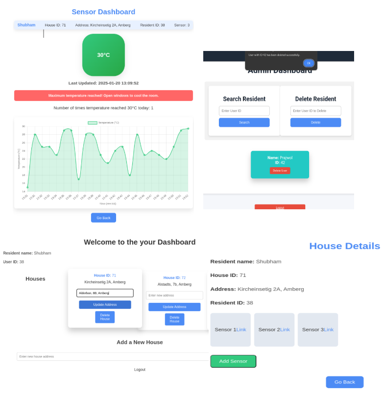

# Smart Home Alert System with Multi-DB Integration & Real-Time Sensor Alerts

A Python-based system that integrates **PostgreSQL** and **MongoDB** for structured and unstructured data handling, uses **Redis Pub/Sub** for real-time sensor notifications, and features a **Flask-based UI** where users (Admins and Residents) can log in, manage their houses/sensors, and receive live alerts. Includes complete CRUD functionality and role-based dashboards.

## Prerequisites
- **Python 3.9+**
- **Redis**: Installed and running.
- **PostgreSQL & MongoDB**: For backend.
- **Postman & MongoDB Compass**: For testing and database visualization.
- **Virtual Environment**: For dependency management.

---

## Setup and Run Instructions

### Step 1: Clone and Set Up the Repositories
1. **Clone the SQL Server Backend**:
   ```bash
   git clone <SQL server repository URL> --branch Ahmed-Ashfaq
   cd MDNEproject/tree/Ahmed-Ashfaq/
   python -m uvicorn main:app --reload --port 8001
   ```

2. **Clone the MongoDB Backend**:
   ```bash
   git clone <MongoDB server repository URL> --branch hmashri
   cd home_automation-main/home_automation-main/home_automation
   python manage.py runserver
   ```

### Step 2: Clone This Repository and Install Dependencies
1. **Clone This Project**:
   ```bash
   git clone <Your GitHub Repository URL>
   cd <cloned_repo_directory>
   ```

2. **Set Up a Virtual Environment**:
   ```bash
   python -m venv venv
   source venv/bin/activate  # For Linux/Mac
   venv\Scripts\activate   # For Windows
   pip install -r requirements.txt
   ```

### Step 3: Start the Application
1. **Run the Main Application**:
   ```bash
   python main_app.py
   ```
   The application will run on http://127.0.0.1:5000.

2. **Run the Redis Real-Time Alert System**:
   ```bash
   python Redis_real_time_alert_sensors.py
   ```

### Step 4: Testing and Usage
- **Database Setup**: Ensure PostgreSQL and MongoDB are configured correctly and accessible via appropriate ports.
- **Navigate to the Web App**: Open http://127.0.0.1:5000 in your browser.
- **Login/Signup**: Transition smoothly between login and signup pages.
- **Admin**: Search and manage users, access all dashboards, and perform CRUD operations.
- **Resident**: Access their personalized dashboard, manage their houses, and view real-time sensor updates.
- **Sensor Management**: Navigate to the sensor dashboard for live updates, alerts, and dynamic plots of sensor values.


<p align="center">
  
</p>

## Key Files
- `main_app.py`: Main application to run the UI and integrate backend services.
- `redis_publisher.py`: Publishes real-time sensor data to Redis.
- `Redis_real_time_alert_sensors.py`: Subscribes to Redis and updates the UI via WebSocket.
- `test_crud_operations.py`, `test_signup.py`, `test_user_vs_admin.py`: Test scripts for validating CRUD operations, signup, and role-based access.

## Notes
- Admins can perform CRUD operations on all users and houses, while residents are restricted to their data.
- Real-time sensor alerts for high temperatures (e.g., >30°C) are displayed dynamically on the UI.
